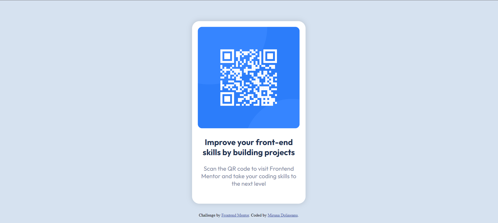

# Frontend Mentor - QR code component solution

This is a solution to the [QR code component challenge on Frontend Mentor](https://www.frontendmentor.io/challenges/qr-code-component-iux_sIO_H). Frontend Mentor challenges help you improve your coding skills by building realistic projects. 

## Table of contents

- [Overview](#overview)
  - [Screenshot](#screenshot)
  - [Links](#links)
- [My process](#my-process)
  - [Built with](#built-with)
  - [What I learned](#what-i-learned)

## Overview

### Screenshot



### Links

- Live Site URL: [Github Pages](https://mirunadoli.github.io/frontend-mentor-qr-code)

## My process

### Built with

- Semantic HTML5 markup
- CSS custom properties

### What I learned

While this was an easy project, it was a good practice for centering content in the middle of the page, which was done using the absolute position:

```css
  position:absolute;
  top: 50%;
  left: 50%;
  transform: translate(-50%, -50%);
```

Another thing that I practiced with this project was the use of flexbox, for the layout of the component:

```css
  display: flex;
  flex-direction: column;
  justify-content: center;
  align-items: center;
```

Overall it was a fun little project that helped me get familiar with the basics of HTML and CSS development.